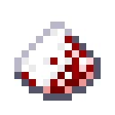

# Baby Powder

Adds baby powder to stop babies from turning into adults.

When a player (or their tamed wolf) kills a baby mob, it has a rare chance of dropping baby powder for that mob. When applying baby powder to a baby mob (by right clicking or through a dispenser), it stops the baby from aging, keeping it cute and cuddly through the sacrifice of other babies.

Statistics have also been added to record how many times you kill baby mobs and how many times they kill you.